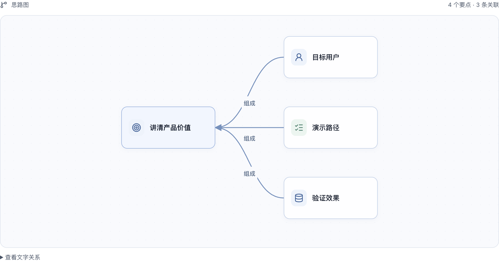

# Meeting Agent

**Follow the discussion. See the structure. Keep decisions with people.**

会中实时理解与协作助手 · macOS / Windows desktop prototype · Two-person project

Discussions move faster than people can turn them into notes, diagrams and follow-up actions. Meeting Agent follows a meeting in the background and offers an on-demand desktop view of the issues, relationships and decisions being discussed. The agent chooses text, a mind map or a flow diagram according to the content.

**My role — Kairui Liu:** I lead product design, most implementation and testing, working with AI. This is a two-person project; my teammate contributes technical input. I designed the low-interruption entry, collaboration review flow and distinction between meeting facts and personal exploration.

[**Quick review · 快速查看**](#quick-review) · [Product choices](#product-choices) · [Validation & limits](#validation-status) · [Run locally · 本地启动](#本地启动) · [Developer handoff · 开发接续](docs/status.md)

## Quick review

**No installation needed to inspect the product:** the image below is an existing screenshot from the actual macOS app package, using synthetic meeting input and a test provider. It demonstrates the interface, not real-model meeting quality.

[](tests/results/demo-live-visuals-validation.md)

1. **See the expression options:** [mind map](tests/results/demo-live-visuals-package/02-mindmap-detail.png), [flow diagram](tests/results/demo-live-visuals-package/04-flow-detail.png), and [streaming draft](tests/results/demo-live-visuals-package/01-live-draft.png).
2. **Trace a collaboration flow:** [draft → host review → distribution → participant response](docs/collaboration-v1-runtime.md). The current participant workflow uses local simulated identities and windows.
3. **Inspect the evidence:** [visual-flow validation](tests/results/demo-live-visuals-validation.md), [bounded Agent workflow](tests/results/agent-workflow-validation.md), and [known gaps](#validation-status). To run the desktop prototype, use the setup instructions below and your own provider configuration.

## Product choices

| Choice · 关键选择 | Why it matters · 用途 | Implementation / detail |
|---|---|---|
| Background understanding, on-demand glance | People can stay in the discussion and inspect a short working view when needed. | [Meeting entry](docs/meeting-entry-spec.md) · [UI](docs/frontend-spec.md) |
| Agent-prepared collaboration, human authority | The agent prepares polls, assignments, conflicts and decision-confirmation drafts from discussion. The host reviews and distributes; participants respond for themselves. | [Collaboration intents](docs/collaboration-intents.md) |
| Separate meeting facts from personal scenarios | A private “what if” does not rewrite the meeting. Quotes and versions make conclusions traceable; changed sources can make a cross-meeting report stale. | [Reliability](docs/agent-reliability.md) · [Cross-meeting collections](docs/adr/006-cross-meeting-collections.md) |
| Bounded work with recovery | LangGraph connects quote retrieval, output validation and limited repair. Unfinished tasks persist across restarts; recording does not restart automatically. | [Workflow runtime](docs/agent-workflow-runtime.md) |

## Validation status

**Delivered:** a desktop prototype with source-linked expressions, personal scenarios, collaboration drafts and persistent tasks. Shared code and local macOS / Windows builds have recorded engineering checks; each result applies to its stated version.

**Still unproven:** reliable continuous understanding and the complete real-meeting workflow. In a **12 September check of `8db0b41`**, synthetic text sent to a real model produced three initial outputs, but all six follow-up additions/corrections failed to produce valid updates. Collaboration distribution is mainly covered by synthetic tests; final Windows hardware validation remains outstanding. [Dated review summary and limits](docs/sessions/2026-09-22-recruiter-entry.md#已知验证边界).

[All validation records](tests/results/README.md) · [Product definition](docs/product-definition.md) · [Decision history](docs/decisions.md)

## 开发接续与阶段记录

[当前状态](docs/status.md) · [AGENTS.md](AGENTS.md) · [session 索引](docs/sessions/README.md) · [实施计划](docs/implementation-plan.md)

<details>
<summary>展开原有工程接续说明（各项按其记录的版本与时间解释）</summary>

[Demo实时表达](docs/demo-live-visuals.md)：主动选择思路／关系／流程图、语义图标、真实生成草稿和局部编辑反馈；连续语音分段2.4秒、理解合并默认250ms。参数不等于端到端时延；源码、双端包和真实效果分别见[本轮验证](tests/results/demo-live-visuals-validation.md)。

四类协作意图已接入：会议工作页 →“协作意图”→“开启自动准备”。模型准备投票、分工、冲突和决定确认的私有草稿；用户检查后可转为本地协作组件，再明确发放并由参与者回应。私有准备和正式发放分开，范围见[意图说明](docs/collaboration-intents.md)与[协作运行说明](docs/collaboration-v1-runtime.md)。

支持 macOS 与 Windows 的会议桌面助手。每场会议是独立事件，Agent 根据自然讨论选择、生成和修订简短的工作表达；用户按需查看、追溯、纠正和推演。

**进度入口：[当前状态](docs/status.md)；跨任务接手：[AGENTS.md](AGENTS.md) → [session 索引](docs/sessions/README.md)。** 已有 0.1.0 首版本地实现；首版结果见[验证记录](tests/results/validation.md)，后续工作树改动和新规范的接入程度以状态及对应 session 为准，不把旧测试视为当前全部通过。

首版协作已合入主线；PR #4整合后，正常音频会议自动初始化本地模拟目录，Agent从自然讨论准备投票、分工、冲突和决定确认。右侧缩略区自动展示，悬停预览、点击固定审核并一键分发；开发手工／回放会议仍显式开启本地协作模拟。参与者A／B／C用独立窗口回应。自动准备衔接LangGraph，正式发放仍由发起者点击。见[设计](docs/collaboration-v1-design.md)、[实际运行与边界](docs/collaboration-v1-runtime.md)、[本轮验证](tests/results/collaboration-v1-validation.md)。

连续 Agent 与新会议入口已纳入基线 `3f6279a`；前端改造已完成独立本地验证，见[前端记录](docs/sessions/2026-09-11-frontend-refresh.md)。架构见 [ADR-004](docs/adr/004-live-agent-pipeline.md)，本轮证据见 [连续 Agent 验证](tests/results/live-agent-validation.md)。首版当时缺少真实模型和转写凭证；PR #3 保留对方 Windows 的单次合成供应商调用记录，不能推导此 Mac 已配置或真实会议达标，见[证据与整合边界](docs/pr3-doc-alignment.md)。

当前接手查[实施计划](docs/implementation-plan.md)与[状态页](docs/status.md)。PR #1–#3、四类意图与跨会议集合已合入main基线 `55267d6`；随后新增的会中原话精修、试算依据、Event评测、实时可视化与悬浮画板按[本轮整合交付](docs/sessions/2026-09-12-main-push-after-sessions.md)记录最终源码、包和验证范围。源码、日常应用与真实效果分别核对。

两端本地包随各次实现更新，准确基线与范围查对应 session 和包指纹；`9b6886d` 的[双端同步验证](tests/results/cross-platform-sync-validation.md)属于历史证据。源码、包内容、日常进程和各机器安装版本分别核对。


</details>

## 本地启动

需要 Node.js 22.12+ 和 npm。macOS、Windows PowerShell 使用相同命令：

```sh
npm ci
npm run setup:desktop
npm start
```

完成首次依赖与运行时安装后，可直接 `npm start`。启动只出现桌面小入口，不自动采音。悬停直接查看当前会议的实时画板，移开后收起；点击打开工作页，右键显示菜单。关闭工作页保留后台服务，退出软件才结束。

```sh
npm run start:built   # 启动上次构建
npm test             # 领域、并发、隔离与架构依赖测试
npm run test:e2e      # 实际 Electron；需要图形桌面，会打开测试窗口
npm run test:stream   # 无外部调用的连续合成压力测试
npm run test:model    # 调用真实模型，无凭证时明确退出，不使用假输出
npm run format:check
```

## 配置模型与转写

开发运行：将 `.env.example` 复制为本目录 `.env`，填入自己的凭证并重启。打包应用也可读取用户数据目录中的 `provider.env`。文件只在可信进程读取，不进入前端或仓库。

```dotenv
OPENAI_API_KEY=你的凭证
MEETING_MODEL=gpt-4.1-mini
MEETING_API_BASE=https://api.openai.com/v1
MEETING_STT_MODEL=gpt-live-transcribe
MEETING_STT_API_BASE=https://api.openai.com/v1
```

当前默认转写为 `gpt-live-transcribe`；显式设置文件转写模型时使用HTTP路径。可用配置以本目录 `.env.example` 和实际供应商账号为准。历史接入及修复证据见[PR #3交付](docs/sessions/2026-09-12-pr3-fix-merge.md)。

这是可修改的默认配置，不保证账号具有对应模型权限。模型使用 Chat Completions JSON Schema 与流式请求；兼容服务不支持结构化格式时可设置 `MEETING_RESPONSE_FORMAT=json_object`，服务仍执行本地 schema 校验。若端点拒绝 `stream`／`stream_options`，只切换格式不能解决；当前不会自动改用非流式请求。返回完整 JSON 的兼容响应仍可读取，但没有中途草稿。转写可单独设置 `MEETING_STT_API_KEY`。远端地址必须 HTTPS；仅本机回环地址允许 HTTP，供本地服务与测试使用。

`gpt-live-transcribe` 使用可信后台到 OpenAI Realtime 的 WebSocket：24 kHz PCM、约 100 毫秒采音包；按麦克风／电脑声音独立连接。工作页显示标为“暂定”的流式转写，只有最终文本入库并进入 Agent。停顿约 600 毫秒或累计 2.4 秒时提交当前段落，暂停／结束也提交尾音。密钥不进入采音窗口。显式设置 `whisper-1` 等文件转写模型仍使用旧 HTTP 路径；连接失败会提示并停止本轮采音，不静默换模型。更改配置后重启应用。此次实际接入和验证见 [流式转写记录](docs/sessions/2026-09-12-live-transcribe.md)。

缺STT凭证时正常开始会提示配置；缺理解模型凭证时不生成假内容。开发入口可独立测试文字、来源和保存；添加凭证后重启可恢复未处理输入。

## 本地模型代理（开发用）

[tools/litellm-proxy](tools/litellm-proxy/README.md) 已在仓库内，是可选开发工具，不随应用打包。其配置提供理解模型 `meeting-chat` 和文件转写 `meeting-transcribe`；当前 GPT Live Transcribe 默认仍由后台直连 Realtime，不通过这个 HTTP 文件转写别名。

开发应用仅在 `MEETING_AUTOSTART_PROXY=1` 且理解地址指向 HTTP 回环地址时尝试自动启动。已有健康服务会复用；缺少 LiteLLM 时可创建目录内 `.venv` 并安装依赖，安装／健康检查不阻塞窗口启动。打包运行不执行此流程，端点不可用仍按真实错误展示。

代理真实凭证仅保存在其忽略的 `provider.env` 中。理解使用本地代理 key 时，Live STT 必须单独配置 `MEETING_STT_API_KEY`，避免回退为代理 key；配置和两种手动启动脚本的差异见工具说明。

## 使用闭环

1. 初次在 Settings 选择系统默认／指定麦克风，以及是否同时收听电脑声音。保存设置不录音。
2. 点击 Start meeting，一次意图创建会议并启动采集；操作系统仍可能要求授权。缺STT配置时进入设置，不创建假成功的会议。已有活动会议直接打开，暂停状态不会自动恢复。
3. 初始使用日期占位标题，Agent有依据后命名；点击标题可以手工改名，之后自动标题不会覆盖。原话持续进入，理解与复杂表达分别推进，页面默认自动跟随并标识局部变化。
4. 原话、来源、历史与处理详情按需打开。空会议没有提问框；有Agent内容后点击“Explore this／进一步讨论”才展开，草稿和问题依据保持原版本。个人探索不覆盖会议事实。
5. 参数试算由确定性计算器执行；会议条件改变时保留草稿基线，用户明确选择才采用新条件。会议决定仍需填写依据和确认范围。
6. 结束释放设备，已接受内容继续整理；重启只恢复内容，不自动录音。导出JSON保留原话和版本。

新安装默认读取macOS／Windows的首选系统语言，中文系统使用简体中文，其余英文；设置各字段修改后立即自动保存，悬浮球开关即时可见；快捷键停止输入后自动保存，底部“完成”仅关闭。失败会回到已保存值并提示重试。新会议输出语言保存快照，不随界面设置漂移。旧偏好保守保留已有语言。

开发测试可在可信进程设置 `MEETING_DEV_INPUTS=1` 后重启，首页的 Development tools 才显示文字／synthetic replay入口。普通用户流程不显示这些模式，无凭证也不会返回假模型结果。

## Agent运行参数

默认参数见 `.env.example` 与 `src/agent/provider.ts`：理解上下文24,000字节、集合上下文32,000字节（`MEETING_COLLECTION_CONTEXT_BYTES`）、单次输出2,500 tokens、每场会议／每个集合各自滚动一小时2,400次供应商调用／4,000,000文本tokens预算、批次合并250毫秒。额度是运行上限，不是承诺时延或价格。缺少用量数据会保守预留并标未知。流式转写在每段发出前检查调用预算，完成后记录该段音频秒数；连接握手限时10秒，每段从开始到完成限时30秒。每通道待完成音频累计上限30秒，WebSocket发送积压上限2MB，超限明确记录缺口，不能承诺持续过载无损。显式文件模型仍用约5秒切片与有界队列。

## 数据与平台

默认不落盘原始音频。原文、对象、产物修订、个人试算、确认记录和输入缺口保存到操作系统应用数据目录的 SQLite，不写入仓库或 iCloud 项目目录：

- macOS：`~/Library/Application Support/Meeting Agent/`
- Windows：`%APPDATA%/Meeting Agent/`

各机器的会议数据库独立，不随Git或应用包自动同步；新库默认无会议，测试事件不会自动注入日常首页。测试使用独立临时目录。数据未加密，随本机账号权限保护；尚无单场会议的应用内删除功能，可在退出后由用户管理数据目录。应用内删除文件夹仅删除该分组及其报告，不删除成员会议。供应商保留政策取决于实际账号，不能把本地不录音解释为云端零留存。

```sh
npm run pack:mac     # 在 macOS 构建应用目录
npm run pack:win     # 在 Windows 构建应用目录
```

本轮本地构建产物位于 `release/mac-arm64/Meeting Agent.app` 和 `release/win-unpacked/Meeting Agent.exe`。Windows 必须保留整个 `win-unpacked` 目录。当前是未签名的本地验证包，不是已签名安装器；Mac Intel、Windows ARM、签名、公证及安装器体验未验收。

## 文档入口与按需阅读

[Agent架构与LangGraph研究](docs/research/README.md)：源码评估、取舍建议与实验设计；不是已采用架构或产品验收。

先读[状态页](docs/status.md)及[相关 session](docs/sessions/README.md)，再按 [AGENTS.md 的任务路由](AGENTS.md)进入产品定义、会议入口、表达语言、前端／语言、技术设计、契约、运行环境或验收。文档职责与冲突处理也在 AGENTS.md，不要求每个 session 通读全部文档。

当前前端视觉与页面入口：[style.md](docs/design/style.md) → [前端交互规范](docs/frontend-spec.md)。用户已认可新 8 图及本轮视觉方向；本地已接入新风格并参考飞书布局细化，见[前端改造](docs/sessions/2026-09-11-frontend-refresh.md)。旧第二张参考仅为历史。

文档修改后执行 `python3 scripts/check-docs.py`；它检查结构与链接，不验证产品行为。新增文件、目录职责或运行命令时同步相关 README，迭代结束前更新状态和 session。

设计文档定义目标；实际 schema 以 `src/contracts/model.ts` 为准，首版实现差异见 ADR-003；后续变化先查状态与对应 session／新 ADR，验证以对应版本结果为准。尚未通过的验收不会因“已有代码”自动变为通过。

本目录是独立 Git 仓库，对应 [Jeffreyliu0131/meeting-agent](https://github.com/Jeffreyliu0131/meeting-agent)。运行不依赖父目录资料。未提交工作须在对应 session 中说明。提交不包含凭证、真实会议数据、依赖目录或应用构建包。


## 条件、修订与会议结束核对

工作内容可展开条件与承诺依据；个人探索不进入后台会议理解。结束后核对已接收内容、未决问题、仍有效条件、任务信息缺项与输入缺口，并可展开汇总记录、查看原话；JSON 导出包含核对结果和本轮起保存的对象历史。记录检查完成不代表语义全部正确或全体共识。实现边界见[Agent 可靠性](docs/agent-reliability.md)。

## 有界Agent工作流

当前本地实现采用LangGraph JS 1.4.14，支持本会议主动检索、独立个人推演、持久提案／任务恢复、澄清与表达修复。运行方式不变；完整实现与限制见[运行时说明](docs/agent-workflow-runtime.md)，逐项结果见[工作流验证](tests/results/agent-workflow-validation.md)。离线人工评分清单：`node --import tsx scripts/workflow-eval.ts`（零模型调用）。不要将`test:model`误作免费离线检查。

## 会议候选提醒

已接入[双语提醒链路](docs/meeting-reminder-spec.md)：球可见时气泡，隐藏时系统通知，点击才开始记录。显示设置可隐藏球，托盘可恢复，已有记录继续。当前没有生产会议检测器，正常运行不会自动产生候选；本轮验证使用合成信号。未正式签名的Mac本地包及未注册的Windows目录包，均不能据此保证系统通知投递。实现与验证见[本轮记录](docs/sessions/2026-09-12-meeting-reminder.md)。


即时设置已通过[PR #2](https://github.com/Jeffreyliu0131/meeting-agent/pull/2)进入主线；`a47cf8c` 是该阶段源码，不是当前最新版本。阶段验证见[记录](docs/sessions/2026-09-12-settings-autosave.md)，当前两端包／安装状态见[状态页](docs/status.md)。

会中工作页采用[正文与窄原话边注](docs/design/meeting-editorial.md)：编号可回到精确原话，核对时保留正在阅读的产物，反馈理解先形成个人草稿。当前实现与双端验证见[本轮记录](docs/sessions/2026-09-12-meeting-editorial.md)。

## 跨会议文件夹与综合纪要

在会议列表创建并命名文件夹，选择1–8场会议；可编辑名称、说明和成员。工作区先展示确定性的决定／未决项／分歧，再由用户手动生成综合报告。引用可返回对应会议，成员或文件夹变化后标记过期，用户决定是否重新生成。

报告不写回成员会议、不共享身份，已记录的协作决定可作为业务依据。当前界面显示最新报告，历史修订仍保存，但无历史选择器或独立导出；生成中重启不会自动续跑。单会议 JSON 导出包含原话、产物、私有草稿和正式协作状态，集合与报告保存在数据库而不随该文件导出。完整边界见[运行说明](docs/agent-workflow-runtime.md#跨会议集合与报告)。

## 会议 Event 与统一评测

[评测方案](docs/event-evaluation.md)提供24类会议Event、60条多轮语料、30项指标和135项规范路由。运行 `node scripts/evaluate.mjs --offline` 执行离线评测；明确需要真实模型评估时再添加 `--model`，它会发起供应商调用。报告绑定源码版本；缺凭证明确阻塞，不把替身当语义成绩。
