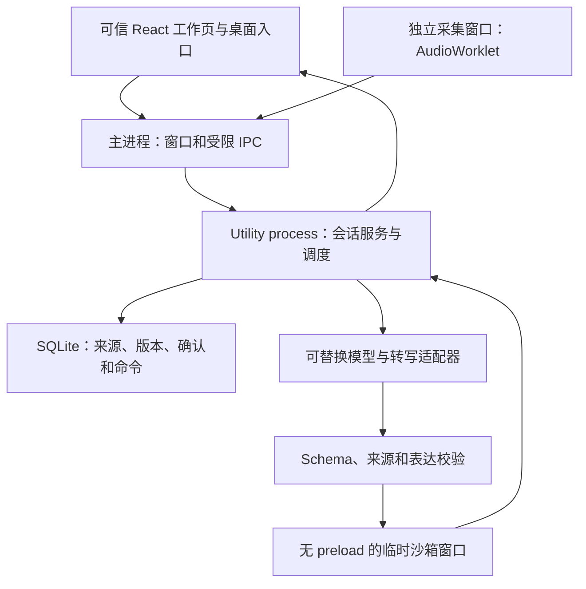

# ADR-003：macOS 与 Windows 共用核心、平台能力隔离

> 适用版本：已提交首版本地实现（`5fcd90f`）。下文“当前”指该实现阶段；后续未提交 Agent 迭代可能改变上下文、调度、队列等细节，见[状态页](../status.md)与[迭代记录](../sessions/2026-09-11-agent-iteration.md)。新取舍应由对应实现任务记录并明确替代条款。

2026-09-11｜本轮开发采用；真实验证范围见 [validation.md](../../tests/results/validation.md)。用户在开发中补充：macOS 和 Windows 同时属于首版目标，不能做成 Mac 专用架构。

> 后续修订：连续Agent、上下文、音频缓冲与页面更新的当前决定见 [ADR-004](004-live-agent-pipeline.md)。本文相关限制保留为首版历史。

## 问题与决定

会议事件、来源和理解状态必须在隐藏页面后继续运行，平台差异不能渗入会议业务。模型需要自由组织表达，但不能得到设备、文件或确认决定的权限。采用 Electron + React + TypeScript，单一可信 utility process 运行会话服务；macOS 和 Windows 共用这套核心与 UI。没有引入分布式服务、多 Agent 或依赖云部署的控制平面。

## 代码边界与不变量

| 层 | 代码 | 唯一职责与边界 |
|---|---|---|
| 协议 | `src/contracts/model.ts` | 运行时 schema 与跨进程类型；无 Electron、存储或模型 SDK |
| 领域 | `src/domain/` | 事件状态转换、身份修订、证据校验、十进制计算；不依赖 UI、数据库或供应商 |
| 应用服务 | `src/service/session.ts` | 命令幂等、顺序理解、并发校验、理解／表达分别失败、恢复调度 |
| 持久化 | `src/service/store.ts` | SQLite WAL、事务、命令哈希与 schema version；写入成功才替换权威内存状态 |
| 供应商 | `src/agent/provider.ts` | `ModelPort` 与真实 OpenAI 兼容 HTTP 实现；真实凭证只在可信进程 |
| 输入 | `src/integrations/` | 独立麦克风／系统音轨、PCM/WAV、来源 epoch 与音频接收许可 |
| 桌面平台 | `src/desktop/` | 窗口、托盘、菜单、快捷键、权限与导出；平台差异不进入领域层 |
| 表达 | `src/renderers/` | 通用文字、表格、关系、时间、图表、SVG、HTML；没有业务模板选择器 |
| UI | `src/ui/` | 选定视觉外壳、集中双语文案、源文／产物／草稿分别显示 |

架构依赖测试阻止领域层反向依赖桌面、数据库、供应商或 UI，阻止前端导入服务或环境密钥。

## 关键取舍

1. **一个本地写入者。** SQLite 当前保存带 schema version 的事件聚合快照和独立幂等命令表。它比几十张尚无实际查询需求的表更小，同时提供原子提交。代价是写放大、全量快照和大事件的恢复成本；支持大量会议前应迁移为逐事件／逐实体表，并增加分页订阅。没有宣称当前存储可无限扩展。
2. **真正的增量语义，保守的并发。** 模型返回新建／更新对象和关系，已有 ID 延续；原文和产物版本不覆盖。输入水位、最新来源 revision 和 languageRevision 由服务检验。追加输入不会让处理永久饥饿；来源纠正和语言切换会作废旧任务。当前使用全会议最新原文＋已有对象，超过 90,000 字符显式停止理解；尚未实现检索式长会记忆。
3. **理解与表达分开失败。** 语义合法时可以提交理解，即使表达校验或渲染失败。旧产物保留；错误和处理水位可见。模型协议错误最多定向重试一次；独立渲染失败当前依赖手动重试，不宣称所有渲染错误都能自动修复。
4. **生成组合，不生成权限。** Agent 选择问题、维度、关系、元素与排列；共享渲染器承接。SVG／HTML 经过允许名单清洗与主动内容拒绝，再由独立、无 preload／无 Node／拒绝网络与设备权限的窗口预览，超时销毁。可见 HTML iframe 禁用脚本及同源权限。首版任意生成 JS 仍禁用；可操作参数由可信 UI 和确定性工具提供。这保留工作表达自由，也让计算与保存可验证。
5. **两端共用采集契约，分别验收系统能力。** macOS CoreAudio loopback 和 Windows WASAPI loopback 由 Electron 实现差异，麦克风／系统声音保持独立 channel。缺系统音轨时线上输入失败，不把外放漏音当系统声音。当前默认麦克风，无实时实名识别，手工映射有独立依据。
6. **停止是输入截止，不是取消已接收事实。** 先请求采集窗口刷新尾部并释放轨道，再递增 epoch。已在服务接收的音频有许可，可在结束后完成转写；新音频不能进入。退出最多等待在途转写 2 秒，未完成部分记录缺口。重启只恢复文字处理，不恢复设备。
7. **没有凭证也保持真实状态。** 可以创建事件、输入文字、纠正和保存；理解／转写明确不可用。生产代码无 mock provider、固定答案或合成图 fallback。HTTP 测试替身只在 `tests/`。
8. **两端构建不等于两端真机通过。** 本轮在 macOS 实际运行 Electron，并交叉构建 Windows x64 目录；Windows 音源、权限、快捷键和安装体验需 Windows 真机。未签名包适合本地验证，不能当作可公开分发的正式版本。

## 下一步架构演进的触发条件

- 长会议触达上下文上限：实现按对象回查与可验证摘要，不能静默裁掉旧条件。
- 音频 5 秒切片造成语义断句或转写积压：将输入适配器替换为有服务端 VAD 的实时转写流；保持同一来源／epoch／身份契约。现有切片是可运行首版方案，不是已验证的低延迟最优方案。
- 多用户共享、跨设备访问：另加认证与服务边界；不得将当前本机 IPC 当公网 API 暴露。
- 开启生成 JS：先加入独立操作消息桥、动作 schema 和资源限制测试；不放宽现有可信 UI 的权限。
- 供应商差异：新增实现 `ModelPort` 的适配器；不要在领域状态机中出现供应商模型名。
