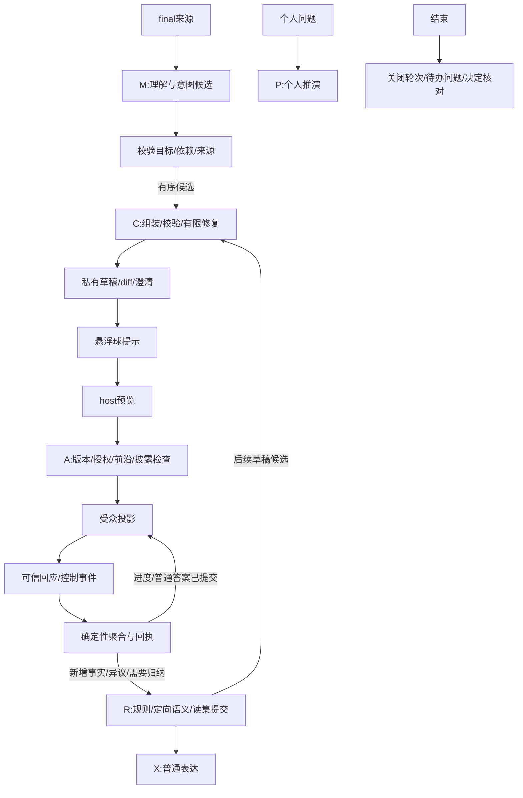

# 第二阶段协作组件设计

COL04展示约束：已填充组件自动显示在固定缩略区，悬停展开、点击固定审核；持续讨论更新同一卡片。悬浮球数量只作辅助，不能成为发现组件的必经入口。

统一体验约束（COL03）：全程静默识别自然讨论中的需求，无需对Agent说话。Agent用默认schema生成完整组件，host只审核后一键分发；编辑／配置仅为可选纠错。信息收集的填写对象是参与者，host不负责从空表设计问题。所有后续组件和验收均遵守此要求。

日期：2026-09-12。状态：规划稿；用户已确认“先补关键闭环，再按议程、信息收集、方案对比、风险与问题清单的顺序新增”。当前未实现第二批组件。对应[实施计划](collaboration-phase2-plan.md)，第一阶段实际边界见[运行说明](collaboration-v1-runtime.md)。

## 1. 当前基线与阶段目标

核对基线为`0cc0db0`，工作目录YH。[Family运行时枚举](../src/contracts/collaboration.ts)只有poll、assignment、conflict、decision_confirmation四类。准备投票是poll的收集状态；会议候选提醒属于桌面开始入口，均不算第二批组件。PR #3的程序回归不能证明第二批已经存在。

第二阶段达到八类组件共用同一条闭环：意图候选 → 私有准备 → 悬浮球提示 → 发起者悬浮窗检查／发放 → 指定参与者互动 → 可信聚合 → 定向分析／后续草稿。先使修订、来源复核、等待恢复和会后核对完整可见，再增加组件。继续采用本地发起者＋A／B／C，最多十个模拟身份；跨设备协作、生产身份认证、真实会议平台分发不在本阶段。

## 2. 第二批组件清单

| family | 解决的会议问题 | 发起者视图／操作 | 参与者操作 | 结果及后续 |
|---|---|---|---|---|
| `agenda` 议程 | 当前讨论什么，哪些议题尚未覆盖 | Agent整理好的纵向议题列表；审核目标／顺序／建议时长并分发，编辑可选；会中选择当前议题、完成或暂缓 | 查看进度，提交希望讨论的问题 | 议题状态＋未处理问题；可建议信息收集或分工 |
| `information_collection` 信息收集 | 缺少约束、事实、需求或意见 | 有界表单，预览问题／必填／选项及受众；查看逐人完成度和本人提交内容 | 填写、修改自己的答案；可明确“不清楚” | 确定性完成度＋有依据的归纳草稿；可建议对比、风险或分工 |
| `option_comparison` 方案对比 | 方案差别在哪里，还缺什么证据 | 方案×维度矩阵，核对每格依据／未知项 | 查看；对指定单元格补充证据或提出异议 | 可追溯比较，不自动选赢家；可准备投票／信息收集／决定确认 |
| `risk_issue` 风险与问题清单 | 哪些潜在风险或已发生问题需要跟进 | 区分风险／问题、影响、触发条件、负责人建议和状态 | 补充事实、提议跟进、确认自己的解决反馈 | 未解决项与处理依据；可准备分工、冲突或确认草稿 |

首版对比组件只做有依据的比较和意见补充；加权评分、排名、匿名评价不纳入第二阶段。议程没有强制倒计时或自动切换。风险项被设置负责人不表示其接受任务，正式分工继续使用assignment。普通临时说明仍走现有生成式表达，避免遇到任何文字都创建组件。

## 3. 共用契约和新增payload

下面是实施目标类型，不是当前API。所有对象转为严格Zod schema；字符串ID长度1–100、Ref.rev正整数；SourceRef沿用现有EvidenceRef。新增元素ID由服务分配，模型使用批内别名；不能以标题去重。

```ts
type Ref = { id: string; rev: number };
type EvidenceRef = import('../src/contracts/collaboration').EvidenceRef;
type Item = { id: string; itemRevision: number };

type AgendaPayload = {
  title: string; // 1–120字
  objective: string; // 0–500字
  items: Array<Item & {
    title: string; outcome: string; // 分别1–120、0–500字
    suggestedMinutes: number | null; // 1–180整数；未知保持null
    topicRef: Ref | null;
    sourceRefs: EvidenceRef[]; // 每项≤20
  }>; // 1–20项；数组顺序即议程顺序
};

type CollectionField = Item & {
  label: string; // 1–200字
  required: boolean;
  allowUnknown: boolean;
  sourceRefs: EvidenceRef[];
} & (
  | { type: 'text'; maxLength: number } // 1–1000
  | { type: 'single_choice'; options: { id: string; label: string }[] }
  | { type: 'multiple_choice'; options: { id: string; label: string }[]; maxSelections: number }
  | { type: 'number'; unit: string; min: number | null; max: number | null }
);
type InformationCollectionPayload = {
  title: string; purpose: string; // 分别1–120、1–500字
  fields: CollectionField[]; // 1–12题；选择题2–12个唯一选项
  responseVisibility: 'host_and_self';
};
type AnswerValue =
  | { kind: 'unknown' }
  | { kind: 'text'; value: string }
  | { kind: 'choices'; optionIds: string[] }
  | { kind: 'number'; value: number };

type OptionComparisonPayload = {
  title: string;
  options: Array<Item & { label: string; objectRef: Ref | null }>; // 2–6
  criteria: Array<Item & { label: string; unit: string | null }>; // 1–8
  cells: Array<Item & {
    optionId: string; criterionId: string;
    assessment: 'known' | 'unknown' | 'disputed';
    text: string; // 0–500字；known需至少一条有效证据
    evidence: EvidenceRef[];
  }>; // 每个方案×维度恰好一个单元格；最多48
};

type RiskIssuePayload = {
  title: string;
  items: Array<Item & {
    kind: 'risk' | 'issue';
    title: string; description: string; impact: string;
    trigger: string | null; // risk发生条件；不能填假概率
    severity: 'unknown' | 'low' | 'medium' | 'high';
    basis: 'participant_reported' | 'agent_inferred' | 'evidence_supported';
    ownerId: string | null; // 仅建议跟进者
    relatedObjectRefs: Ref[];
    conflictRefs: Ref[]; // 已有具体矛盾引用ConflictRecord，不复制成第二份冲突真相
    evidence: EvidenceRef[];
  }>; // 1–20；标题≤120，description／impact≤500，每项证据≤20
};
```

单组件序列化上限仍为32 KiB；超过限制先分组为私有候选，不能截断字段后当完整组件发放。发布日期、受众、票数、答案作者、状态、水位和事件ID由可信服务生成，不进入模型可写payload。每个组件增加`contentSchemaVersion`；新版本读旧组件时只补默认值，未知类型显示只读“需要更新应用”，不按最后一个分支猜成决定确认。

公开payload保持不可变。议程进度／风险处理状态属于独立round control投影，由`expectedControlVersion`保护，不能为了改“当前议题”而重新发放整个payload或清空回应。改题目、选项、评估维度、风险描述等语义内容仍须新revision和新公开轮。条目删除留tombstone，模型不得在后续更新中复活。

### 3.1 新的可信交互

所有命令仍有id、meetingId、绑定actor和componentId；以下字段在统一命令解析后严格校验。修改普通回应使用自己的expectedResponseVersion，不依赖其他人是否刚回应。

| 命令／response kind | 特有字段 | 约束 |
|---|---|---|
| `agenda.set_progress` | publishedRevision、itemId、itemRevision、expectedControlVersion、status=current/done/deferred | host；最多一个current；切换以单事务更新控制状态；计时不触发它 |
| `agenda_question` | itemId、itemRevision、commentId、text | audience提交本人问题，不能改议题顺序 |
| `collection_submit` | answers: [{fieldId, fieldRevision, value}] | audience；整份答案原子保存；必填题不能空缺，unknown须allowUnknown；非法选项／NaN／范围越界拒绝 |
| `comparison_comment` | cellId、cellRevision、commentId、stance=supplement/objection、text | audience；不直接重写比较格；最新自己回应不暴露其他人私有理由 |
| `risk_feedback` | itemId、itemRevision、commentId、kind=context/objection/resolution_report、text | audience；解决报告不是“风险已解除”的自动事实 |
| `risk.set_status` | publishedRevision、itemId、itemRevision、expectedControlVersion、status=open/monitoring/resolved、resolutionEvidence | host；resolved需有效依据、相关R通过、无未撤回异议；来源变化可回到待复核 |

旧`component.respond`封装以上新增response kind，继续校验publishedRevision和expectedResponseVersion；仅两种控制命令另走controlVersion。answered、viewed、accepted、confirmed不是同一状态。议程／风险的控制历史在重启时恢复，但不会恢复录音。

## 4. 悬浮窗与提示设计

维持主工作区索引＋发起者／参与者独立悬浮窗。准备就绪不自动弹窗；悬浮球提示含“待检查／可发放／有新回应／待复核”分组和数量，同一组件只保留最高优先级提示。纯查看清除未读标记，不改变组件状态。用户隐藏悬浮球时继续尊重设置，入口保留在工作区，不另行强开系统通知。

议程使用纵向列表与当前项标记；信息收集使用单栏表单、自己的提交状态及未完成提示；方案对比使用表格，窄窗改为逐方案卡片，未知值显式占位；风险清单使用严重程度标记、证据和处理状态，不只靠颜色表达含义。所有新增外壳、校验、错误和无数据态同时提供中英文；正文保持会议输出语言，原话不改写。

共同新增修订diff抽屉，按稳定条目ID显示新增／修改／删除，逐项接受模型建议；保留未保存输入，明确基线已更新。公开预览显示将共享的正文、理由和摘录，participant投影在服务端裁剪；信息收集原始答案默认仅host及本人，归纳／转为后续组件仍需host确认披露。

## 5. LangGraph与事件触发矩阵

沿用M理解、C准备、R分析、X普通表达、P个人推演，A代表可信命令服务，Z代表结束核对。增加清晰的路由／提交模块，不另建一个永久运行的“大图”。



| 组件 | M阶段 | C阶段 | 参与者回应后的A/R | Z阶段 |
|---|---|---|---|---|
| 议程 | “列一下今天议题”“先讨论这些”→prepare/update；“换下一项”仅host动作建议 | 创建议程草稿；缺目标时澄清 | 进度切换零模型；问题先记录，显式归纳或议题收尾才R | 保存完成／暂缓／未讨论项目 |
| 信息收集 | “请各自补充限制条件／需求”→prepare；可prospective收集题目 | 生成有界问题，不能假填参与者答案 | 提交立即ack；有新事实标dirty，按组件合并；显式归纳／截止触发R→比较／风险／分工候选 | 关闭提交，区分未回应与“不清楚” |
| 方案对比 | “比较A和B，看看成本与交付时间”→prepare/update | 从对象及已授权证据生成矩阵，未知不补造 | 异议即时推进分析欠账；R只分析受影响格／依赖，结果提出修订或冲突；投票需host另发 | 冻结比较及未决分歧，不自动选方案 |
| 风险与问题 | “有哪些阻塞／上线风险”→prepare；有证据时可suggestion | 生成列表并标推测／已支持；R输出可反向唤起 | 反馈先保存；解决报告触发R复核，host才能设置resolved；具体排期矛盾进入已有conflict | 未解决／待复核项进入会后核对 |

“转换成投票／分工／确认”只形成私有下游草稿。批内意图增加localId、dependsOnLocalIds、expectedTargetRevision；拓扑有环或引用不存在时整批候选不提交，基础会议理解仍可保存。最多四个候选；超出保留可见待处理范围。准备态、否定／引用／假设过滤适用于全部八类。

### 5.1 调度和恢复规则

沿用每个C／R任务最多2次模型调用、总并发4且为M保留一个槽。按组件合并250 ms内的新反馈，仅用于安排R，不延迟回应落库或dirty水位更新。发放／记录操作先冻结已收到来源和相关回应前沿；等待列表可查看原因、取消动作或重试同一ID，取消不会删除来源。

每根事件最多八个语义job；超限持久为blocked_budget，不自动制造新root重置预算。host点击“继续分析”可创建有parentRootEventId的显式新根，受小时总预算限制，界面显示尚未处理范围。进程中断重放已保存提案，不重复调用；R提交采用受影响组件／条目／对象／回应的读集，不把无关新来源当作冲突。语义分析失败也保存已完成的确定性规则事实，保留semantic_pending，不能清除确认门槛。

## 6. 交付门槛

先通过首批关键闭环门槛G0，再逐类启用新family；每类都需要schema、角色投影、命令、持久化、图路由、双语三视图、悬浮提示和Electron闭环，不能只增加按钮就标为完成。检查项及执行顺序见[计划](collaboration-phase2-plan.md)。旧62项按原ID补证据，不删除不通过的要求。

本阶段真实模型评估使用合成文本；至少60段，其中八类各6段，加12段跨类／否定／歧义。计划目标：family与operation联合判定≥90%，目标引用正确≥95%，越权发布／虚构回应0例；未知／歧义场景不得直接创建开放轮。程序测试与真实语义分列，Windows和macOS分别报告；未实测平台不宣布验收。日历任务同步、真实身份识别、外部投递、匿名票、自动代理他人同意仍不在范围。
