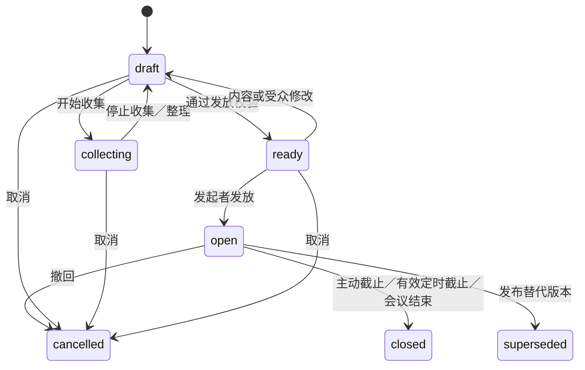
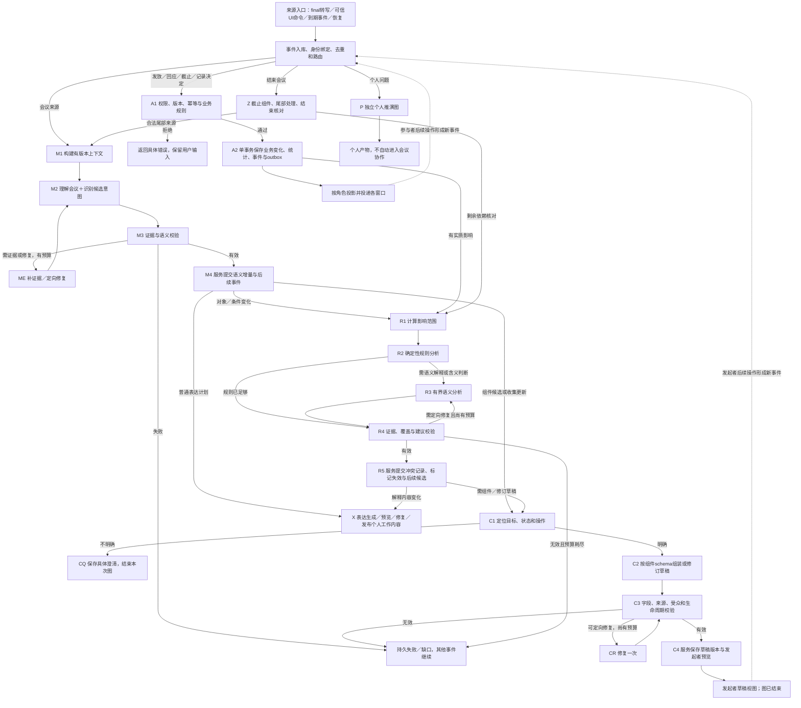

# 首版会议协作：意图、动态组件与工作流设计

版本：`collaboration-v1 / design-1`。日期：2026-09-12。
状态：已获执行授权并完成首版核心接入；本文保留完整目标，实际实现和差距见[运行说明](collaboration-v1-runtime.md)及[验收结果](../tests/results/collaboration-v1-validation.md)。

阅读顺序：本文 → [数据与交互契约](collaboration-v1-contracts.md) → [验收场景](collaboration-v1-acceptance.md)。接手依据：[当前实际运行时](agent-workflow-runtime.md)、[本轮记录](sessions/2026-09-12-collaboration-components-design.md)。

## 1. 目标、范围与设计选择

首版闭环：理解会议意图 → 自动准备结构化组件 → 发起者检查／发放 → 参与者回应 → 可信记录与统计 → Agent分析影响 → 更新草稿或提出下一步组件。

纳入四类组件：投票 Poll、分工 Assignment、冲突 Conflict、决定确认 DecisionConfirmation。投票含准备／收集阶段；分工支持只展示及请求接受；冲突同时存在于分工行内标记和独立组件。所有组件有发起者、参与者、结果三种视图。

本地使用一位发起者和三位模拟参与者验证，允许最多十个模拟身份。角色身份来自应用绑定的窗口会话，不来自语音或模型推断。支持 Windows 与 macOS 同一套契约和界面；跨机器网络、真实会议平台分发、身份认证、匿名投票、日历／任务系统同步、多主持人、拖拽排期均不纳入首版。

新增协作为可选模式。已有个人按需查看、通用生成式表达、个人推演保持可用；不要求所有会议先建参与者名册。只有开启协作后才出现组件草稿区和发放入口。固定 schema 约束具有业务副作用的四类组件，Agent 仍自主决定是否需要组件、内容、关联及组合；普通会议表达继续走原通用表达路线。

### 方案比较与推荐

| 路线 | 优点 | 代价／适用边界 |
|---|---|---|
| 单个大图接管转写、发布、投票、渲染 | 图上看似直观 | 高频回应依赖模型队列；等待用户容易阻塞持续会议；副作用难重放 |
| **事件路由＋有界语义图＋可信命令服务（采用）** | 回应即时、恢复明确；复用现有持久任务和提交机制 | 需要明确事件、版本、投影及图间契约 |
| 自由生成所有交互页面／逻辑 | 外观灵活 | 投票计数、身份和状态校验难统一；不利于本轮快捷出组件 |

设计采用第二条。新增有界子图承担分析与提案，单写服务承担业务状态和分发。各图一次处理有限输入然后结束；等待人操作保存为组件状态，不把图一直挂起。

## 2. 人物、权限及事实边界

| 角色／来源 | 可以做什么 | 不能据此推导什么 |
|---|---|---|
| 发起者 Host | 准备、编辑、发放、截止、撤回；选择冲突处理方案；符合规则时记录决定 | 不能代投、代接受任务或把未回应记成同意 |
| 参与者 Participant | 查看发给自己的组件，回应自己的票／任务／确认，报告相关问题 | 无权改发布内容、扩大受众或读取其他人的私有草稿 |
| Agent | 识别意图、补全草稿、标注缺项、提出冲突与解决建议 | 无权自行发放、投票、接受任务、记全体决定 |
| 未确认身份的语音 | 可成为会议内容和候选操作的证据 | “开始吧”“我同意”不能直接变为有身份的授权操作 |
| 本地模拟身份 | 窗口对应一个明确的虚拟参与者，可验证独立交互 | 不表示真实人员已经参与或已完成真实认证 |

首版操作授权入口为可信 UI。语音里明确的“开始投票”生成发起者侧待执行动作；按钮始终可直接发放，不需要再走模型理解。发起者预先点击“准备投票”也可建立收集会话。发起者可以是投票／决定确认的参与者，但必须在参与范围内并提交自己的回应。

会议信息证据、结构化参与者回应、Agent推断、会议决定分别存储。展示一个分工不等于负责人接受；投票结果不等于决定；所有指定人员对同一版本明确同意后，发起者才可记录“指定范围已确认”。文字永远显示具体范围，不用“全体共识”替代实际名册。

## 3. 意图模型与识别规则

意图是结构化候选：`family × operation × target × scope × evidence`，同时记录表达方式及歧义。一次输入可输出多个有序候选，最多四个；超出时保留待处理范围，不能默默丢弃。组件身份由可信服务分配；不能按标题相似度自动合并。

### 3.1 业务意图与操作意图

| family | 意图内容 | 常见输入 |
|---|---|---|
| `poll` | 收集偏好或选择 | “在这三种方案里选一个”“接下来准备投票选项” |
| `assignment` | 组织任务、负责人和交付约定 | “前端交给小林，接口交给小周”“请各自确认分工” |
| `conflict` | 识别／解决安排、依赖或约定的矛盾 | “两件事时间撞了”“这个日期比前置任务还早” |
| `decision_confirmation` | 对明确结论和条件收集确认 | “按这个安排执行，请大家确认” |

| operation | 合法用途 | 是否直接改变参与者端 |
|---|---|---|
| `prepare` | 创建普通草稿或持续收集草稿 | 否 |
| `update` | 给确定目标补充、修改、删除字段 | 草稿自动更新；已发布内容只提新版本草稿 |
| `preview` | 展示草稿及缺项给发起者 | 否 |
| `publish` | 发起者 UI 发放确定版本／受众 | 是；语音识别结果仅待执行 |
| `respond` | 参与者 UI 提交结构化回应 | 更新合法可见投影 |
| `close` | 发起者截止或执行已批准截止时间 | 是；不等于达成决定／解决冲突 |
| `cancel` | 取消草稿或撤回开放组件 | 是；已收回应保留历史 |
| `propose_resolution` | 提议冲突解决操作 | 只生成草稿，不应用 |
| `apply_resolution` | 发起者选择解决方案，生成受影响修订草稿 | 不直接修改已发布任务 |
| `record_decision` | 发起者记录符合确认规则的结果 | 创建有范围、有依据的决定记录 |

语义识别补充输出：`no_action`、`needs_clarification`、`unsupported`。UI操作直接映射命令；没有必要重新让模型分类“投票提交”按钮。

### 3.2 什么情况下触发，什么情况下不触发

| 输入／事件 | 判定 | 行为 |
|---|---|---|
| “准备投票，接下来是三个备选方案” | 明确准备意图 | 建立 collecting 草稿，绑定议题和起始来源水位 |
| “就刚才三个方案投一下” | 明确投票意图，回溯前文 | 引用已存在方案，生成待检查草稿；缺选项时先补证据 |
| “要不要投票？” | 建议／疑问 | 给发起者轻量建议，不能直接开放投票 |
| “先别投票”“如果将来要投票……” | 否定／假设 | 不新建；明确指向现有流程时提出取消／暂停收集操作 |
| “这个方案叫‘开始投票’”或引用他人的话 | 引用内容 | 不能当发布指令 |
| 同一任务出现明确责任与交付物 | 可用分工候选 | 创建／更新分工草稿；缺日期可保持未知 |
| 一人明确拒绝已分配时间 | 结构化异议或可靠原话 | 记录分歧；分析相关任务，生成私有冲突草稿 |
| 同一人两项任务只有同一天截止 | 不足以判定时间占用重叠 | 显示“需要确认工作量”，不报确定冲突 |
| 所有人均已投票 | 计数事件 | 提示发起者可截止；默认不自动截止、不自动确认赢家 |
| 某票导致当前第一名变化 | 中间统计 | 只更新统计，不每票调用模型或生成决定卡 |
| 投票截止，发起者选择某方案进入确认 | 明确后续意图 | 生成决定确认草稿，引用投票结果与所选方案 |
| 决定草稿所依赖任务被修订 | 版本失效 | 立即标记依据变化；重新核对，旧同意不继承到新版本 |

自动建议：已提交的会议理解中存在至少两项明确备选且讨论仍未决，可提出投票建议；有明确任务可提出分工；有证据的冲突可生成私有冲突草稿；出现明确拟定结论可提出确认卡。用证据和字段校验控制行为，模型自报置信度不产生发布权。未知、弱证据只给建议或澄清。

为避免重复打扰，候选按会议、议题、family、目标对象集合和目的定位；同一语义事件只处理一次。发起者忽略建议后，在新的相关对象版本出现前不再次唤起。讨论回到旧议题时优先定位旧草稿，定位不唯一则澄清。

### 3.3 持续收集与开始口令

每个 collecting 草稿保存 topicRef、scope说明、起始来源ref、已消费来源ref、字段来源和排除项。可以显式选用前文引用；“接下来”默认只收集准备动作后的相关新内容。收集范围是议题相关内容，不是吞掉其后所有转写。

只有 stable/final 转写进入业务分析，partial 只供实时阅读。Agent输出针对字段的增删建议；手工改过的字段被锁定，后续语音只能提出修改建议。删除选项保存 tombstone，不能在下一批因重复提及自动复活。

发起者点击发放时，冻结当前已接收 final 来源水位并结束收集；相关已排队分析完成后生成 ready 预览。若仍有输入缺口，显示缺口并让发起者明确采用眼前版本；不把点击前未识别到的音频保证为已收集。最终发布命令携带 ready 版本，后续发言不能进入已发放选项。

同一会议最多四份活动收集草稿。裸“开始吧”只有一个近期明确目标时才能生成候选动作；多个目标时必须选择目标。首版无声纹身份，因此即使目标唯一也需要发起者 UI 执行发布。

## 4. 生命周期、内容版本和更新

`needsReview`、缺项、错误、来源覆盖、投递状态作为独立字段，不与生命周期混成几十种状态。closed 不代表同意、胜出或解决；业务结果独立保存。已结束／撤回／替代的版本不可重新开放；再次发起建立新版本和新回应轮次。

同一逻辑组件有稳定 componentId；每次编辑得到不可变 revision；publishedRevision 指向正式版本。发布后可并行准备 replacement 草稿，参与者仍看到旧版本。替代发布时在一个事务里截止旧轮、保存新轮、冻结新受众并通知；旧回应只展示为历史，不自动迁移。草稿层允许逐字段保留手工编辑，已发布层不接受Agent直接patch。

过期依据需要立即提醒。若变化涉及投票选项、负责人、时间、决定条件等实质字段，对受影响轮次标记 `responseGate=blocked`，提示正在核对；与之无关的组件继续工作。发起者可发布修订版或有依据地重新验证原版。重新验证原版只适用于内容语义未改变的来源修正，不能靠点击消除实质变化。

## 5. 四类组件的行为与界面

共同布局：类型图标与简短标题 → 状态／发放范围 → 业务正文 → 主操作 → 折叠来源与修订。按用户实施中补充，组件以独立悬浮窗展示：发起者编辑／预览／发放在组件窗内，参与者也在独立悬浮窗回应；主工作区仅保留组件索引和打开入口。通过校验、尚未发放的组件在悬浮球显示待处理数量，悬停显示类型与内容提示，点击提示打开预览；提示与采音状态独立。Agent准备完成不自动抢焦点；关闭组件窗不取消草稿、不停止会议。结果归入可回看的历史区。

### 5.1 投票 Poll

目的：对明确定义的选择收集偏好。首版支持单选、多选、显式弃权；不支持排序票、加权票、匿名票和自动平票裁决。

准备阶段显示“正在收集投票内容”、已识别题目／选项和缺项。“停止收集并预览”冻结来源水位。编辑包括题目、选项、选择数量、参与者、截止时间和结果可见规则。默认单选、允许弃权、发起者手动截止、所有人截止后可看汇总；投票开放期间发起者也只看回应人数，不显示领先项。

参与者视图：单选圆点／多选勾选项；“提交投票”按钮；成功后显示“已提交，可在截止前修改”。未选择、选多了、已截止、版本变更均有明确提示。弃权与未回应分开。首版实名记录，但参与者端仅显示汇总和自己的票；发起者截止后可看逐人明细。界面明确说明这些可见规则，不能宣称匿名。

结果：每选项票数、占有效投票人数比例、已投／弃权／未回应人数、平票状态。多选比例合计可能超过100%，标注分母；零票不显示虚构百分比或赢家。统计由服务计算。无论是否有唯一最高票，下一步都由发起者选择“基于结果准备确认”或“重新投票”，不自动记录会议决定。

发布门槛：题目非空、2–12项有效且不重复的选项、单选／多选限制自洽、1–10位确定受众、已说明结果可见规则、截止时间有效、来源与草稿无阻塞。选项可以人工输入但必须标注为人工内容。

### 5.2 分工 Assignment

目的：把讨论中的任务与约定整理为可核对的责任表。首版一项任务一个主要负责人，可有多个协作者；负责人未知时显示“待指定”。任务完成跟踪、外部执行和自动催办不在范围。

发起者视图：表格列为任务／交付物、负责人、时间、依赖、讨论点、回应状态。讨论点用浅色标记，潜在冲突用橙色图标＋文字，已核实的不相容关系显示明确依据；点击行内标记打开冲突细节。无冲突的行不铺满状态装饰。

发布模式二选一：`display` 只展示，允许参与者提出问题；`request_acceptance` 要求主要负责人逐项接受、提出异议或建议调整。展示模式允许缺负责人／日期，但必须保留未知标签。请求接受要求每项有唯一明确负责人且该人位于受众；日期未知仍可接受任务范围，显示“时间未约定”，不能理解成接受某日期。

参与者只对自己负责的行接受／提出异议；其他受众可以报告问题。协作者在首版不承担隐含接受义务。发起者不能替某人标记接受。接受状态绑定 itemId、itemRevision 和发布轮次，修改负责人、交付物、依赖或时间后重置对应行接受状态；为简单和可审计，替代发布整轮回应也不自动继承。

结果按行显示已接受、有异议、未回应、仅展示。Agent 可提出冲突和修订建议；已接受的任务不会因模型推断被自动改负责人或日期。存在未决问题不禁止只展示；请求接受若有已核实的不相容约束必须先修正，待核实风险则明示后允许发放。

### 5.3 冲突 Conflict

目的：把“哪里不一致、依据是什么、怎么处理”变成可定位的工作项。它可由会议发言、分工校验、参与者异议、依赖修订或结束核对触发，并不限于初始意图分类阶段。

首版类型：时间区间重叠、前置依赖矛盾、负责人安排不一致、约束违背、明确参与者异议。工作量不足只在有容量依据时判定；没有依据时是待确认风险。时间区间重叠须同一负责人、可靠时区、明确起止时间，且任务要求独占投入；仅相同截止日期不成立。环形依赖由确定性算法识别。

冲突先成为有稳定ID的分析记录，同时在发起者草稿／相关分工行内标记。独立冲突卡默认仅发起者可见；向参与者展示需显式发放，并检查冲突的全部依据均可向这些人披露。首版不自动对私人依据脱敏后发放；缺可共享依据时阻止发布并提示具体缺项。

视图：冲突摘要 → 左右／上下并列的关联安排 → 原话／数据依据 → 影响范围 → 待确认问题 → 候选处理方案。标签区分“规则检查发现”“Agent推测”“参与者提出”。窄窗上下排版。候选方案列出将改哪些任务字段，不能只写“建议协调”。

参与者可以说明实际约束、认可某个候选方案或提出新建议，不能直接改别人的任务。发起者选方案后先生成分工／确认修订草稿并看差异，再发布；语义建议不直接执行数据库补丁。冲突只有在相关新版本经规则／证据复核，且明确异议有对应本人回应消解后才记为 resolved；“截止讨论”只关闭卡片，冲突仍可 unresolved。

多项同源冲突按规范化类型＋有序关联对象集合＋约束ID归并，保存新的证据版本。一个改动触发的相关问题聚合成一张卡，避免给每次分析新增卡片。判断受限时记 `coverage=partial`，显示未检查范围。

### 5.4 决定确认 DecisionConfirmation

目的：让指定参与者对同一版结论及条件给出明确反馈。投票结果、调整后的分工、会议拟定结论都可成为来源，但不会自动得到“同意”。

发起者编辑内容：一句明确结论、适用范围、仍有效条件、关联任务／方案、必须确认的名册。首版规则固定为 requiredParticipants 全部明确 agree；不支持主持人一票覆盖、沉默同意或自动多数决。requiredParticipants 等于本轮受众，发起者需要表态时也加入名册。

参与者视图：结论与条件置顶，“同意”“有保留”“不同意”三个同等级语义选项；后两者要求简短说明；未操作显示未回应。开放期间可修改自己的反馈，服务保存历次版本。参与者默认看到逐人反馈状态；具体说明仅本人和发起者可见，发起者另行选择可共享的内容进入冲突卡。

所有人 agree 后显示“已收齐同意，待记录”；发起者点击“记录此范围决定”时重新验证版本、依赖、未决实质冲突、全体required回应。成功事务同时创建Decision、绑定回应快照并关闭组件。任何有保留、不同意、未回应、响应阻塞均不允许成功记录。发起者可先截止为“未达成”，仍保留反馈。

已记录决定不会因后来的反对被改写；后续变化进入新修订／新确认轮，并标记旧决定待复核。此状态不等于自动撤销历史事实。

## 6. 样式、交互与可访问性

继承 `collaborative-light-v2`，不新增独立主题。白色正文、深色文字、蓝色主操作；淡橙表示待确认／风险，绿色只表示真实完成状态。投票条形统计使用中性蓝，不用绿色暗示最高票已被批准。

建议尺寸：组件标题20px／600，正文15px／1.55，辅助信息13px；容器圆角12px、内距20–24px、字段间距16px。标准组件宽560–760px；分工表允许填满工作区，窄于720px改逐任务纵向布局。参与者独立窗口最小360px可读；200%缩放支持内容撑高与滚动，按钮不覆盖正文。

每个组件同屏最多一个主操作；删除、撤回放次级菜单。发放按钮旁直接显示“发给3人／开放回应”或“发给3人／仅展示”。预览显示准确受众、当前版本、将重置的旧回应，不增加与行为无关的确认弹窗。修改已公开版本时必须看到变更摘要。

响应状态区分“尚未提交／正在提交／已保存／提交失败”；只有服务ack后显示已保存。失败保留输入并提供重试，不能乐观计入票数。来源详情、版本详情默认折叠。流式讨论更新不移动正在输入的选项／行，不覆盖输入法组合、滚动位置和焦点。

语义控件采用原生radio／checkbox／button／table等；状态同时有文字，键盘可操作，来源抽屉关闭回到原控件。`aria-live`只播报提交结果、截止和重要失效，不逐票播报计数。语言沿用会议输出语言快照，UI标签跟随个人界面语言；不把自动翻译当作对新内容的再次确认。

## 7. 修改后的完整运行结构

### 7.1 从当前实现迁移

当前 `src/agent/workflow.ts` 已实现 interpret → validate → evidence／prepareRepair → result，运行时由 SessionService 管理job、版本校验、预算和提交。设计保留这些职责：M复用理解图，C新增组件提案图，R新增影响分析图，X保留表达任务，P保留个人推演，Z扩展结束核对；A为可信命令服务，绝不混成模型代理。

以下是目标逻辑结构；子图名称与节点为设计，不是已经存在的导出函数。没有要求为了画在同一张图里把全部服务编译为一个StateGraph。

### 7.2 节点职责与调用成本

| 节点 | 输入与输出 | 模型调用／副作用 |
|---|---|---|
| E0 | 原始事件 → 可信actor、eventId、来源ref、聚合目标 | 零模型；事件持久化，UI命令以A2事务作为成功界线 |
| M1 | accepted来源、领域对象、活动组件目录、collectors → 有界上下文 | 零模型；不全量塞入所有票或组件历史 |
| M2 | 当前上下文 → 语义增量＋IntentCandidate[]＋普通表达计划 | 通常一次；意图与理解在同一调用完成，避免重复理解 |
| M3／ME | schema、来源、语义检查；必要时本会议证据检索 | 继承实时最多2次理解调用／1次工具；额度耗尽记缺口 |
| M4 | 经校验提案 → 对象版本、候选和后续工作事件 | 可信事务；不直接发组件 |
| C1 | 候选＋组件目录 → create／update／建议／澄清／no-op | 确定性优先；只接受明确目标或带证据候选 |
| C2 | 目标、稳定对象与来源 → 四类payload或字段patch | 结构化数据充分时零模型；不足时一次组装调用 |
| C3／CR | payload → validated草稿、缺项或修复 | C图共最多2次模型调用（含生成和修复），不无限重试 |
| C4 | 草稿、read set → 不可变revision、变更摘要、ready条件 | 可信事务；只对host可见 |
| A1／A2 | 有身份命令 → 接受／拒绝、统计、当前投影 | 零模型；权限与数据规则通过才提交，模型掉线仍可互动 |
| R1／R2 | 对象／回应变更 → 受影响集合、规则结果 | 零模型；依赖图＋时间／负责人／条件检查 |
| R3／R4 | 规则结果、必要原话及说明 → 语义冲突、候选方案 | 最多2次模型调用／1次证据工具；覆盖不足须标注 |
| R5 | 经校验分析 → Conflict记录、失效标记、C候选 | 可信事务；不会自行选择解决方案 |
| X | 普通表达任务 → 原通用产物 | 沿用现有独立表达预算；组件固定渲染器不进入生成HTML路径 |
| P | 个人请求 → 个人产物 | 沿用个人图最多4次；结果只有host明确重新提出且核对来源后才能准备会议草稿 |
| Z | 结束命令＋来源水位 → 截止和核对结果 | 截止零模型；尾部理解与影响分析分别进入既有预算队列 |

上述调用上限为设计初值，尚未压测；所有图共享原小时预算及四槽供应商池，至少保留一个槽给会议理解。C／R加入非理解调用类别，共用其余槽，轮转防止个人任务或组件互相饿死。M、C、R的计数各自持久化，不能借切图重置预算。

每个根事件衍生的C／R工作最多八个语义job，超出保留backlog并显示处理范围，不删除。相同事件＋目标版本＋工作类型幂等；无实质diff的patch不产生新领域事件。一次因果链不能反复为同一目标创建同用途组件；相关新外部事件才开启新判断。R没有变化直接结束，C保存草稿不会默认再次唤起M。

### 7.3 哪些阶段唤起哪些组件

“唤起”分为创建草稿、更新私有提示、发布参与者视图、更新结果四件事。只有A2可发布参与者视图。

| 阶段／触发节点 | 投票 | 分工 | 冲突 | 决定确认 |
|---|---|---|---|---|
| M2理解／意图 | 明确准备／投票意图；多方案未决时建议 | 任务、交付物和责任讨论形成候选 | 发言中出现矛盾／异议形成分析候选 | 明确拟定结论或请求确认形成候选 |
| C2草稿组装 | 从前文提取选项，或更新collector | 生成任务表及未知项 | 把R已校验的冲突转为可读卡；无R分析不能伪造确定冲突 | 组装结论、条件、required名册 |
| C3发布前校验 | 重复选项、选择规则、缺受众提示 | 发现规则冲突→送R，展示／接受门槛不同 | 校验双方依据和受众可见性 | 未决实质冲突／失效依据阻止ready→送R |
| A2正式发布 | 参与者看到开放投票 | 参与者看到展示表／接受入口 | 经host批准后相关参与者看到冲突卡 | 指定名册看到确认入口 |
| A2提交回应 | 即时计数；中间票不调用R3 | 接受更新状态；异议→R | 新约束／方案意见→R | agree只计数；有保留／不同意→R |
| R影响分析 | 选项依据失效则阻塞／提出修订 | 关联任务变化，提出修订草稿 | 规则／语义证据产生、合并、复核冲突 | 条件或冲突变化使当前轮待核对 |
| A2截止／结果 | 统计固定；host选择后可送C准备确认 | 保存逐人接受／异议；不自动生成承诺 | 保存讨论结果；是否resolved由R复核 | 全同意后host可记录决定，其他情况标未达成 |
| Z会议结束 | 截止开放投票，保留未回应 | 固定当前接受状态与缺项 | 未解决项进入结束核对 | 未记录的全同意仍为待记录，不能自动升级 |

C3发现冲突时，当前草稿可保存但ready受阻；以独立事件交给R，不在C和R之间同步无限递归。冲突解决方案指向投票时首版只提供“准备投票”候选动作，必须由host选择，不自动连发投票。

### 7.4 事件顺序、并发和实时性

UI回应优先在单写服务完成短事务并ack；模型调用不持有数据库锁。会议理解、组件job与影响分析可排队并发计算，各自用可信read set、组件revision、aggregateVersion、fence做提交检查；发布、回应、截止按同一服务序列串行提交。

poll／confirmation的每次提交都保存回应，但不要求客户端带整个组件aggregateVersion，以免别人投票导致我的票冲突；命令带publishedRevision和自己的expectedResponseVersion。发布／修改／截止由host带expectedAggregateVersion保护。服务时间决定截止边界，事务内再次检查；按收到命令时间或客户端时间不能绕过已截止状态。

R对同一影响集合合并500ms内事件，最多等2秒即执行一次；确定性计数与失效标记不等模型。新异议在当前R运行期间到达时保存dirty标记，下一轮处理；不取消已提交反馈。目标为本机命令ack P95≤300ms、投影送达P95≤500ms；模型草稿／分析目标另测，不作为已达性能。

每个组件保存与其依赖有关的`requiredAnalysisSequence`和`validatedAnalysisSequence`。存在尚未核对的相关事件时，发放／记录决定不能抢在R之前通过；A2保存异议或相关条件变更时同事务推进required水位并设置门槛。R仅可验证自己实际读取的事件范围，不能清除运行期间新到事件的dirty状态。普通投票／agree与无关来源不推进分析门槛，避免每票调用模型。

发布和记录决定另冻结“点击时已收到的final来源”前沿：这些来源尚未进入M时，按钮状态为“核对已收到的讨论”，不能假定尚未分析的内容与决定无关。完成该有限前沿后检查相关依赖版本；新来且无关的来源不使前沿无限增长。前沿内有失败来源时，发布普通组件可明确承认缺口并采用眼前版本；record_decision须先消解可能影响结论的缺口，不能由统一忽略按钮绕过。尚未转写的音频仍属未知范围，确认依据快照明示截止水位。

收集更新按现有约1.5秒批次合并，重要UI命令不等待该合并计时。发起者正在编辑时，Agent新建议旁置可应用diff，不抢写字段。已有输入缺口、分析积压、过期内容都在相关组件上标明。

## 8. 持久化、分发及恢复

### 图状态与持久任务的对应

M、C、R的调用状态共同携带jobId、rootEventId、scope、acceptedEventRefs、readSet、目标组件／对象版本、proposalRef、validationIssues、route及预算端口；M另有语义context和IntentCandidate[]，C另有目标解析、collector快照、草稿基线和payload候选，R另有影响集合、规则结果、覆盖范围及冲突提案。大量原文／完整回应不在节点间反复复制，只传可信引用并按需读取。

route是枚举而非模型给出的任意节点名。M走done／evidence／repair／failed；C走no_op／clarify／assemble／repair／save／blocked；R走no_change／rules_only／semantic／repair／commit／failed。所有END均回到任务服务更新完成／失败／等待澄清状态。模型输出不控制图拓扑或工具权限。

LangGraph内存状态只服务一次有界执行；重启恢复继续使用现有持久job、不可变proposal、fence与成功记录。首版不同时再引入第二套checkpointer作为业务真相来源。已经保存有效提案时重放提案提交，尚无提案时在剩余额度内重新计算；所有副作用经幂等服务端口。M4／A2／R5的后续job和事件在业务事务内记录，事务后调度，避免“业务成功但后续分析事件丢了”。

投票与普通接受提交只唤醒确定性投影；跨图调度由事件类型及结构化变化决定。多个后续job可以独立排队，但涉及同一对象的提交由版本／分析水位约束，不依赖Promise完成顺序来决定事实。

新增规范化存储：participants、components、component_revisions、component_responses、conflict_records、collaboration_events、delivery_outbox、delivery_receipts。字段与事务见[契约](collaboration-v1-contracts.md)。普通会议对象仍是语义事实，组件引用它们，不用同一份文本维护两套独立任务真相。采纳任务修订时，领域对象与新组件版本同事务更新。

回应唯一键为组件＋发布版本＋主体（poll／confirmation为person；assignment为person＋item；conflict为person＋commentId）。响应历史追加保存，当前投影选当前有效版本。eventId、commandId和outbox唯一键防重；本地投递按至少一次处理，前端用sequence去重。点击已提交后断线再重试不会产生第二票。

窗口每次连接先请求权限过滤的当前快照和lastSequence，再补事件；不能把host全量Meeting snapshot广播给参与者后用CSS隐藏。worker→main→各renderer链路必须做投影隔离，不能复用当前host全量snapshot IPC供参与者查看。

重启保留开放组件／回应／草稿、重放未确认outbox；不会自动录音或自动发布草稿。已过deadline的开放投票先在事务中截止，再接受新连接命令。模型任务恢复继续既有job／budget／fence；模型不可用时仍可对有效已发布组件回应、查看和截止。

会议结束事务先关闭所有开放轮次（reason=meeting_ended）并结束collector；旧回应保持。尾部音频仍可形成原话与私有补充草稿，不能重新开放互动。Z列出待处理来源、未发草稿、未回应、未解冲突、尚未记录的确认结果和投递缺口。首版已结束会议不再发新轮；需要协作时建立新会议并明确引用历史。

## 9. 本地模拟方式与身份约束

发起者在开发用“本地协作模拟”入口创建3个标为模拟的身份，并分别打开独立参与者窗口。窗口固定角色，不共享同一个可随意切换actorId的表单。main用webContents身份映射到worker中的actorContext；renderer不能通过命令参数选择别人身份或升级host。

角色切换控制台仅属于开发入口；标题持续显示“本地模拟 · 参与者A”。可以关闭／重开某一窗口模拟断线、重发同一commandId、故意提交旧版本。逻辑参与身份在同一模拟会议期间稳定，关闭窗口不代表弃权或退出确认名册。名册更改只影响下一次发布，旧轮受众快照不变。

投递状态分为queued、delivered、viewed、responded：窗口收到并ack只证明delivered；组件实际进入可见视区才发viewed；回应保存才是responded。无人在线也可成功保存发布，host看到“待送达”，不声称所有人已收到。

不把应用全局设置、密钥、其他会议、个人推演、host私有草稿或未公开回应通过参与者IPC发出。本地文件可被操作系统账号读取属于部署边界；模拟不能被描述为具备远程认证安全性。

## 10. 实施边界、拆分与完成标准

推荐按依赖顺序实施：①领域契约与可信命令／存储／权限投影；②固定四组件与host／participant界面；③事件路由、M候选与C图；④R影响分析、闭环与恢复；⑤合成对照、实际模型与双端验收。先让手工草稿到参与者回应全程可用，再接自动准备，便于区分UI规则问题和模型语义问题。

建议新增 `src/contracts/collaboration.ts`、`src/domain/collaboration/`、`src/agent/collaboration/`、`src/service/collaboration/`、`src/ui/collaboration/`。保留现有workflow入口并逐步抽出共用校验／预算端口；避免继续把所有逻辑堆入SessionService。具体文件名由实施阶段核对，以上是目标模块边界。

原产品定义／决策中“共享可后续扩展”的范围，本轮增加为可选首版协作模拟；普通生成式表达路线不被组件替代。当前实际运行时文档继续描述已实现代码，只增加本设计入口。没有代码、模型、平台或真实会议验收通过前，不把本设计写成产品已具备能力。

完成标准以[验收清单](collaboration-v1-acceptance.md)为准：四组件闭环、准备态、节点触发、权限／版本／幂等、重启和结束均有证据；模型语义与程序正确性分别验收。首版默认值已在本文确定，可在设计评审中修改；实施不得自行扩张到匿名投票、外部发送或自动代表他人确认。
