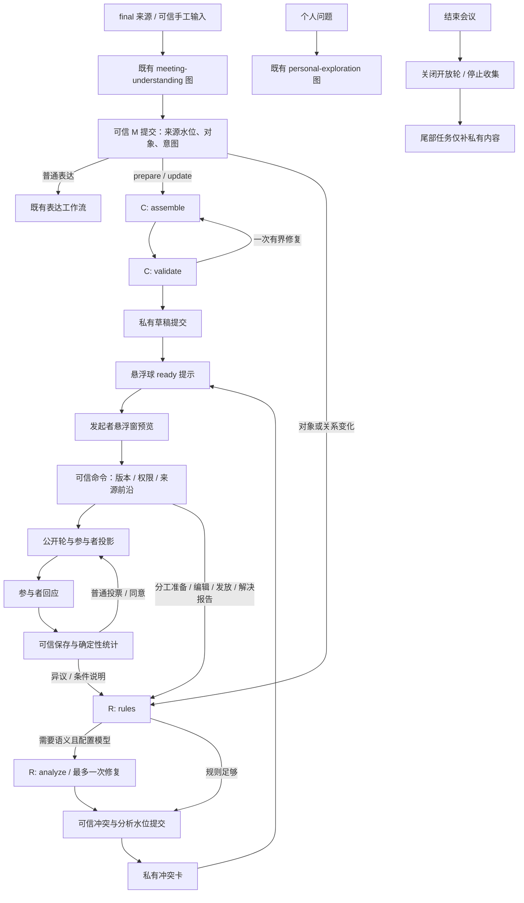

# 协作组件：首版实际运行时

当前核心已随 [PR #3](https://github.com/Jeffreyliu0131/meeting-agent/pull/3) 合入 `5878c20`，私有意图与集合在 `55267d6` 继续整合；双端包有对应交付记录。本文说明源码行为；[设计](collaboration-v1-design.md)保留完整目标，原[62项矩阵](../tests/results/collaboration-v1-validation.md)、后续[修复](../tests/results/pr3-fix-validation.md)／[整合验证](../tests/results/branch-integration-validation.md)分别说明版本范围。当前包与安装状态以[状态页](status.md)为准。

## 使用路径

在会议工作页开启“本地协作模拟”，建立发起者＋A／B／C四个独立身份。已有会议不会自动启用协作。身份来自可信窗口绑定，音源或发言中的姓名没有投票权限。

准备投票、分工、冲突或决定确认后，在独立置顶悬浮窗编辑。主工作区只保留索引。ready且未发放的版本在悬浮球显示数量，悬停预览提供类型／题目，点击提示打开组件。Agent准备完成不会自动抢焦点；关闭悬浮窗不会取消组件、提交回应或停止会议。

发起者选择受众、可公开依据摘录后点击发放。参与者窗口只收到受众范围内的公开轮次，不收到草稿、任务队列或其他人的私有理由。投票开放期间只显示回应人数，截止后显示结果。分工接受由负责人本人提交；有保留／不同意不算同意。决定需要同一公开版本中指定范围全员明确同意，再由发起者记录。

冲突解决方案先生成相关任务的修订草稿，旧公开任务保持原样。发起者打开分工悬浮窗选择“准备修订”，检查并重新发放。接受新轮与支持解决方案是不同操作。报告者可以明确标记自己的问题解决；发起者不能代替其撤回。已记录决定允许原参与者提出新问题，只标记待复核，不重新开放旧轮。

## 实际图及触发位置

设计中的C1–C4映射到实际`assemble`／`validate`及服务提交；R1–R5映射到`rules`／`analyze`及服务提交。A、投递、统计与决定门槛是可信服务操作，不消耗模型调用，也不为了画图包装成LLM节点。M、X、P沿用已有图；无协作意图不调C。语音“发布／开始／截止／取消”只生成提示，不继承人的操作权限。

本人对任务／确认改为接受或同意后，可信服务重新运行确定性R，解除对应旧异议，以及只依赖该已撤回回应的语义冲突；独立report_issue仍需报告者明确标记解决，其他来源支持的冲突不随同意消失。

投票从M意图或手工准备唤起；分工从M或手工准备唤起；冲突由R输出唤起或发起者选择已有冲突准备；决定确认由M候选或手工准备唤起。选择解决方案会准备修订任务、澄清或投票草稿。个人分支不产生这些共享操作。

## 状态与持久化

运行时契约在[collaboration.ts](../src/contracts/collaboration.ts)。四类payload使用严格判别联合；模型提案不能写actor、计数或公开状态。草稿revision不可变追加；round冻结内容、受众、共享依据；response带公开版本、本人subject及本人responseVersion。当前草稿与公开轮可以并存。

SQLite同一事务保存会议变更和`collaboration_*`表：meta、participants、components、revisions、rounds、responses、conflicts、events、receipts、decisions、jobs。先commit再交换内存／广播。事件sequence支持重连恢复与delivery ack；参与者离线期间保留公开快照，重开窗口恢复。没有网络会议服务或跨设备同步。

发布、停止收集及记录决定保存点击时final来源前沿。尚未处理时返回`ANALYSIS_INCOMPLETE`；窗口保留同一payload的命令ID供重试，来源前沿不随无关新发言扩张。内容版本改变时必须重新预览。来源／对象失效立即阻断相关公开轮的回应；复核只接受已成功R任务及内容未变的当前草稿，否则必须发布新版。

每个C／R任务最多2次模型调用，调用前持久记账，保留既有小时预算与总并发4／理解保留槽。C保存提案后提交，读到的来源更正或手工版本变化会使旧结果失效；R对来源、对象、组件、回应的读集校验，迟到结果不清除新的分析欠账。恢复不退款、不恢复采音。规则检查采用明确独占区间和依赖环，不把相同截止日推断为时间占用。

## 与目标设计的差距

首版核心闭环可本地模拟；以下仍是目标，不能把测试替身视为它们已经验收：

- [60条多轮评测语料](event-evaluation.md)已建立，真实模型意图质量和真实多人音频仍未验收；整合阶段已有 Mac 包检查，Windows 真机仍待验。默认 STT 已是 GPT Live Transcribe；旧阶段未改配置的记录不代表当前还使用文件转写。
- 协作新增表单目前以中文为主；完整双语、屏幕阅读器与窄窗细节仍需补验，现有主界面语言功能继续保留。
- 正式组件手工锁以字段／数组为单位保留，尚无逐项 tombstone 和专用可合并 diff；私有意图已经有条目删除保护、字段锁和旁置建议，不能把前者缺口扩大到两条路径。转交保留内容，不自动把私有编辑保护变成正式组件的同等编辑能力。
- 正式 `collaborationIntents` 最多4条、按候选顺序排队，尚无批内显式拓扑；私有 `intentPreparation` 已校验 `dependsOnLocalIds`、后向引用并保留忽略策略。两条路径都不能仅凭程序规则保证任意同义表达定位准确。
- 每根事件第9个及后续任务保留为带`ROOT_JOB_LIMIT`的失败记录；尚无后台自动续跑入口。R读集采用保守会议范围，目标中的完全定向最小读集尚待完善。
- 前沿等待已持久化，当前由同窗口重试继续；尚无独立等待列表／取消前沿UI或“承认输入缺口仍发放”通道。记录决定时若会议存在inputGaps，明确返回INPUT_GAP_UNRESOLVED；由于当前缺口没有可证明的逐组件归属及补全状态，采用会议范围保守阻塞，其他查看／投票／发放不受此门槛影响。没有自动删除缺口或人工跳过门槛，真实缺口补全仍是后续能力。
- 协作决定单独保存并进入协作列表、M上下文与用户选择的跨会议汇总；完整 Meeting JSON 导出包含 `collaboration.decisions`，没有伪造 Artifact 塞入旧 `Meeting.decisions`。两类决定尚无统一展示／导出摘要，跨会议报告也没有独立导出入口。
- 确定性R可独立运行；语义R失败时保留分析欠账，不宣称冲突已排除。模型推测冲突没有一键裁决为事实的入口。

这些差距在[62项验证矩阵](../tests/results/collaboration-v1-validation.md)中标为部分覆盖或未验证。当前不会自动调用外部系统发消息、执行任务或推送代码。

FTY整合：可先启用私有意图准备（Meeting.intentPreparation），保留条目删除、字段锁和旁置模型建议；停止收集并核对后，明确转为本地协作组件。转交只创建／更新私有组件预览，不发放、不猜口头姓名的身份。原FTY旧库状态在加载时迁移到独立字段。正式记录的协作决定现在可被用户选择的跨会议集合汇总，其引用属于业务确认记录，不写入原话。详见[本轮整合](sessions/2026-09-12-branch-integration.md)。
