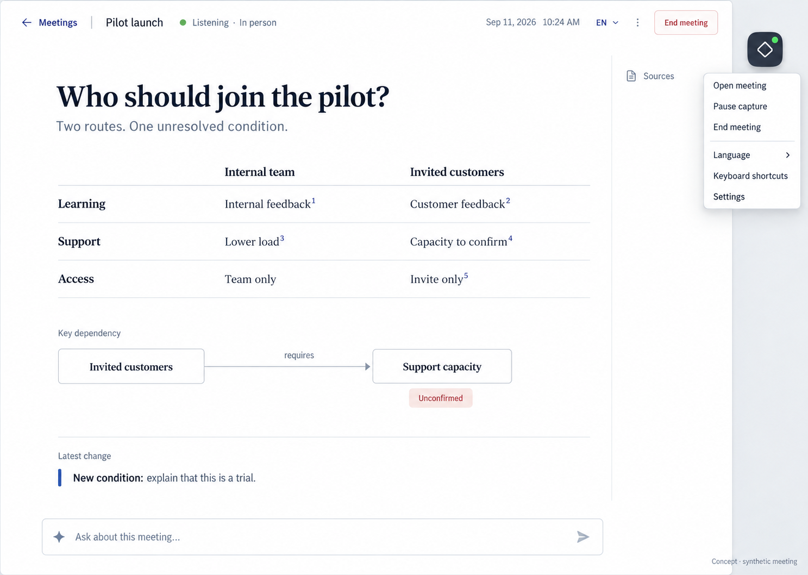

# 当前设计决策：已认可的 8 图方向

2026-09-11 用户在 Chrome 查看新生成的 8 张图后认可整体风格，评价其清晰、具有现代协作办公产品的感觉，并要求生成 style.md 和同步项目页面描述。此前用户明确不上传旧参考图、让生成端自由发挥；本轮未提供旧图。

## 当前采用

- 当前视觉与页面规范：[style.md](style.md)，本地标识 `collaborative-light-v2`，尚未迁移到运行时。
- 来源：[8 图及生成端规范会话](https://chatgpt.com/c/6aa41aad-b754-83ec-a77d-04c5095bdc19)。图组包含首页、会中、来源、推演、空会议、会中设置、桌面入口、结束回看；首次无采集的初始化仅有文字补充。
- 采用的是整体风格：浅色、清楚层次、蓝色主要操作、内容优先、按需来源和推演。参数、合成文案和图片暗示的额外功能不自动获得确认。
- style.md 是根据生成端可见正文和项目契约形成的本地修订版。原始附件下载被 Chrome 组织策略拦截；未绕过下载控制，原附件和新图片仍在来源会话内，未声称本地归档。
- [前端规范](../frontend-spec.md)与[会议入口](../meeting-entry-spec.md)继续约束行为；style.md 已列出与生成端原文的校准。当前代码和旧 [tokens.json](tokens.json) 未因本轮文档修订而自动完成迁移。

## 替代与验证边界

本决定替代下方历史记录中“旧第二张是当前视觉唯一基准”的要求。保留浅色、低打扰和工作内容可读性，但不继续强制旧图构图、字号和配色。旧图片不删除、不移动，以免破坏历史依据。

新视觉参数是实施起点。局部静态色对计算见 style.md，不能据此认定整套 UI 已通过对比度或无障碍验收。真实交互、首次初始化、错误状态、双端、缩放和键盘仍须验证。本轮仅文档整理，不改产品代码、不提交／推送／部署。

---

以下全部为**被上述决定部分替代的历史记录**，用于追溯旧选择，不能直接作为当前视觉要求。

# 历史记录：旧第二张视觉方向与克制材质

> 2026-09-11 后续修正：用户实际使用后要求改善层次，并明确取消空会议常驻问答框、每场配置表单与固定英文默认。最新约束见[会议入口规范](../meeting-entry-spec.md)。本页以下保留选图的历史依据；概念图的底栏不再是必须复制的布局，语言遵循最新系统匹配规则。

## Decision Summary

2026-09-11用户选择本任务显示顺序中的第二张概念图为前端视觉基准，并要求参考苹果设计中的细腻质感，保持清晰、舒适且不抢占工作注意力；英文默认、中文可选同时确认。

## Context

产品的主体是持续生成的会议工作内容。外壳需要足够一致，防止下轮工程自由拼出与已确认体验不同的界面；同时不能把概念图中的比较结构固定成所有会议的模板。

## Options Considered

| 原显示顺序 | 方向 | 结果 |
|---|---|---|
| 第一张 | 浅色绿色强调、持续左侧会议导航、关系图主体 | 未选定 |
| 第二张 | 浅色轻导航、排版与留白、对照内容、轻量来源入口 | 用户选定 |
| 第三张 | 深色专注工作区与悬停速览示例 | 未选定，不作为默认深色实现授权 |

## Evaluation

评价依据来自用户要求：工作级清晰、较低的视觉负担、简短表达、易于追溯、日常长时间使用舒适，以及Agent生成结构的自由度。没有用户研究或可用性结果，不把偏好等同于效果证明。

## Decision Rationale

保留第二张的布局方向和内容优先级。通过系统字体、较克制的标题尺度、清楚的行列对齐和细分隔加强工作感。外围浮层可用轻磨砂表达层级，正文与图表维持稳定不透明底，避免桌面背景影响阅读。

苹果Materials指南区分导航／控制与内容层，建议克制使用材质并照顾可读性和减少透明度设置。这里只借鉴原则，不声称已实现苹果原生材质或其系统级效果。[官方指南](https://developer.apple.com/design/human-interface-guidelines/materials)

## Trade-offs Accepted

- 不采用整页玻璃和强动态效果，减少视觉存在感；质感通过间距、字重、边界与轻层级建立。
- 主工作区没有永久宽侧栏，历史和来源需要一次按需打开，换取内容空间。
- 图中衬线标题与表格字体不逐像素复制；统一系统无衬线字体是本轮细化建议，以中英连续阅读为目的。
- 材质不支持时使用实色回退；正确显示与低干扰优先于平台视觉一致。

## Reversibility

材质、字阶、间距和颜色通过token调整；保留事件、生成产物、来源、状态与交互契约。若实际阅读测试发现字体、标题或材质不适，应迭代token，不重新改变产品结构。

## Follow-up Considerations

下一工程需验证悬停误关、鼠标／键盘焦点、工作页关闭后后台持续、跨显示器入口位置、200%缩放、亮／暗／复杂桌面背景上的材质对比、Reduce transparency／motion，以及中英文布局。未验证之前不能声称完全无干扰。

## Supporting Materials

- 图像来源：本任务ImageGen第二个实际显示结果，2026-09-11用户明确选中。
- 原始结果标识：`exec-ee07593b-a7bf-4b0b-9df2-9fc957248a84.png`。副本与原图字节一致，原图未移动或修改。
- 状态：静态概念参考、合成会议；不是实际产品截图，不验证交互。图片还未加入本轮材质细化，实施以[前端规范](../frontend-spec.md)为准，不把旧图误称为精修稿。
- [设计tokens](tokens.json)、[界面文案](ui-copy.json)、[语言规范](../language-spec.md)。

## Decision History

| 日期 | 记录 | 依据 |
|---|---|---|
| 2026-09-11 | 选择第二张、英文默认中文可选、参考苹果克制材质 | 用户本轮明确确认 |
| 2026-09-11 | 整理页面／入口／语言／材质的实施约束 | 助手按已确认方向编写文档，工程未实现 |
